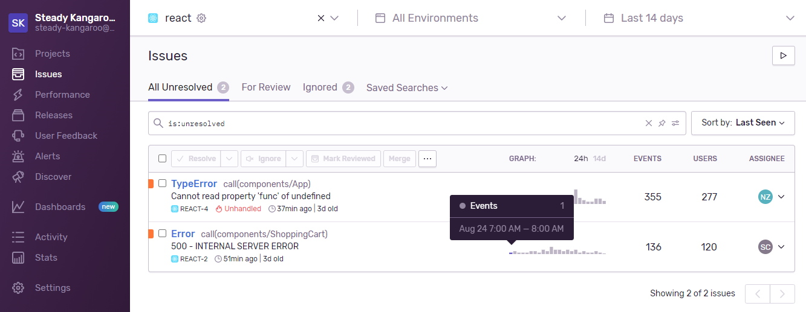
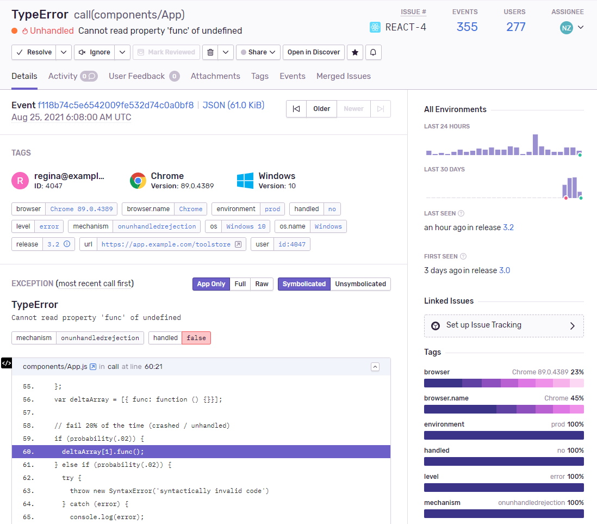

# エラー監視 SaaS の Sentry を布教したい


---

# Sentry を使うと何が嬉しい？

今までエラー発生に備えてログ出力を工夫していたのに......

- エラーを補足できなくて再び試行錯誤
- どんな時にエラーが発生したのか分からず出力内容を試行錯誤

という**トライアンドエラーの手間を大幅に削減**できる！
単なるテキストから、可視化されたエラー監視の時代に行ける。

---

# Sentry の概要

## エラーの**監視**、**収集**、**発生ユーザー特定**に特化

主要な言語とサービスに対応


---

# エラー監視の様子



---

# エラー監視の様子


- どんなエラーが発生したか
- いつ何件発生したか
- どこで発生したか
- どんな環境で発生したか

が分かる！

---

# エラー監視の様子



- ユーザー情報を自動でタグ付け
- コンポーネントの State 情報
- Stack Trace、コードを可視化

それぞれの情報で絞り込みして類似事例など判別可能！

---

# 導入も超簡単、数行だけ書いて後は自動

```bash
yarn add @sentry/nextjs
npx @sentry/wizard -i nextjs
```

例えば Next.js では**上記コマンドで自動適用**が完了。
設定ファイルなど生成されて運用開始できる。

基本的に**既存コードはそのまま使用可能**で、
Sentry 用のコード書き換えが不要なのが嬉しい。

---

# 条件指定でアラートを設定可能

どんなエラー、どんな頻度の時、誰に通知するかが選べる。
エラー毎にフラグを立ててトリアージも可能。

# パフォーマンス監視も可能

ページ描画やトランザクション処理の要した時間の計測が可能。

---

# 個人用プランなら無料でお手軽に始められる

https://sentry.io/welcome/

## サンドボックス環境も公開されているので試してみてね

https://try.sentry-demo.com/organizations/ultimate-tiger/issues/
